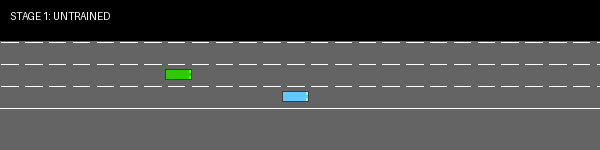
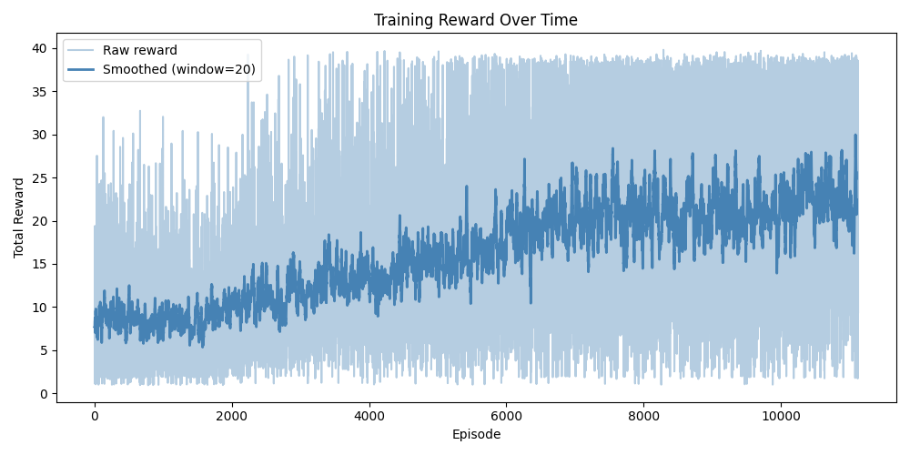

# 🚗 Autonomous Driving with Highway-Env


**Student:** Bora Robert Orhan  
**Course:** CMP4501 – Applied Reinforcement Learning  
**Track:** Option A – Autonomous Driving with Highway-Env  

---

## 🎬 Training Evolution

The GIF below shows the agent at three stages of training — untrained, half-trained, and fully trained.



---

## 📚 Methodology

### a. Reward Function

The default Highway-Env reward function is defined as:

$$R_t = \alpha \cdot v_{norm} - \beta \cdot \mathbb{1}_{collision} - \gamma \cdot \mathbb{1}_{offroad}$$

Where:
- $v_{norm}$ — the vehicle's normalized speed (higher speed = higher reward, encouraging the agent to drive fast)
- $\mathbb{1}_{collision}$ — a binary penalty applied when the agent collides with another vehicle
- $\alpha, \beta, \gamma$ — weighting coefficients that balance speed vs safety

This reward function is suitable because it directly encodes the multi-objective nature of autonomous driving: the agent must drive **fast** while avoiding **collisions**. The collision penalty dominates when crashes occur, forcing the agent to learn defensive driving before optimizing speed.

---

### b. The Model

**Algorithm:** Deep Q-Network (DQN)

DQN was chosen because Highway-Env provides a **discrete action space** (lane left, idle, lane right, faster, slower) — DQN is specifically designed for discrete actions. It learns by maintaining a **replay buffer** of past experiences and training on random samples from it, which breaks the correlation between consecutive steps and stabilizes learning.

**Key Hyperparameters:**

| Parameter | Value | Reason |
|---|---|---|
| Total Timesteps | 200,000 | Enough for clear learning on CPU |
| Learning Rate | 0.0005 | Conservative — prevents unstable updates |
| Gamma (γ) | 0.99 | High discount — agent values future rewards |
| Batch Size | 64 | Balance between speed and gradient quality |
| Buffer Size | 10,000 | Stores enough diverse experiences |

**Neural Network Architecture:**  
`MlpPolicy` — a fully connected network with two hidden layers of 64 units each, using ReLU activations. Suited for the kinematics observation type which outputs numerical vectors, not pixels.

---

### c. States and Actions

**Observation Space:**  
The agent observes a **kinematics matrix** of shape `(5, 5)` representing the 5 nearest vehicles (including itself). Each vehicle has 5 features:

| Feature | Description |
|---|---|
| `x` | Longitudinal position |
| `y` | Lateral position |
| `vx` | Longitudinal velocity |
| `vy` | Lateral velocity |
| `cos_h` | Heading direction |

**Action Space:**  
The agent can take one of 5 discrete actions:

| Action | Description |
|---|---|
| 0 | Lane change left |
| 1 | Idle (maintain lane and speed) |
| 2 | Lane change right |
| 3 | Faster |
| 4 | Slower |

---

## 📈 Training Analysis

### Reward Graph



### Commentary

The training curve shows three distinct phases:

**Phase 1 (Episodes 0–2,000) — Exploration:**  
The agent behaves nearly randomly with an average reward of ~8. The exploration rate starts at 1.0 and decays slowly, meaning the agent is mostly taking random actions and building up its replay buffer. Rewards are low and highly variable.

**Phase 2 (Episodes 2,000–6,000) — Active Learning:**  
The smoothed reward climbs steadily from ~10 to ~18. The agent begins to associate staying in lane and avoiding collisions with higher rewards. The exploration rate has decayed enough for the policy to meaningfully influence decisions.

**Phase 3 (Episodes 6,000–11,129) — Convergence:**  
The agent stabilizes around an average reward of 20–25, with a final average of **23.37** over the last 50 episodes. The performance ceiling is partly due to the stochastic nature of traffic — some configurations are unavoidable regardless of policy quality.

**Key stats:**
- Total episodes: 11,129
- Max reward achieved: 39.81
- Final average reward: 23.37
- Improvement over untrained: ~3x

---

## ⚠️ Challenges and Failures

**Challenge 1 — Slow training speed (8 fps)**  
Early in development, training ran at only 8 fps because the environment was rendering visually during training. Disabling rendering with `render_mode=None` in `make_env()` was the fix — however, 8 fps turned out to be a fundamental limitation of the Highway-Env physics simulation rather than a rendering issue. The solution was running a longer overnight training session with `caffeinate` to prevent the Mac from sleeping.

**Challenge 2 — The agent still crashes when fully trained**  
The fully trained agent occasionally crashes despite 200,000 steps of training. This is because Highway-Env generates traffic stochastically — some collision scenarios are physically unavoidable regardless of the agent's policy. This is reflected in the reward variance remaining high even in later episodes. A potential improvement would be reward shaping to penalize being in high-risk positions proactively, rather than only penalizing after a crash occurs.

---

## 🗂️ Repository Structure
Autonomous-Driving-with-Highway-Env/
│
├── README.md
├── requirements.txt
├── src/
│   ├── train.py       # Training loop with checkpoint saving
│   ├── evaluate.py    # Loads checkpoints and records GIFs
│   ├── model.py       # Environment and DQN model definition
│   ├── utils.py       # Reward plotting and GIF stitching
│   └── config.py      # All hyperparameters in one place
├── assets/
│   ├── evolution.gif  # Training evolution video
│   └── reward_plot.png
├── checkpoints/       # Saved model weights
└── logs/              # Training reward logs
---

## 🚀 How to Run

```bash
# Install dependencies
pip install -r requirements.txt

# Train the agent
python3 src/train.py

# Evaluate and record
python3 src/evaluate.py
```
